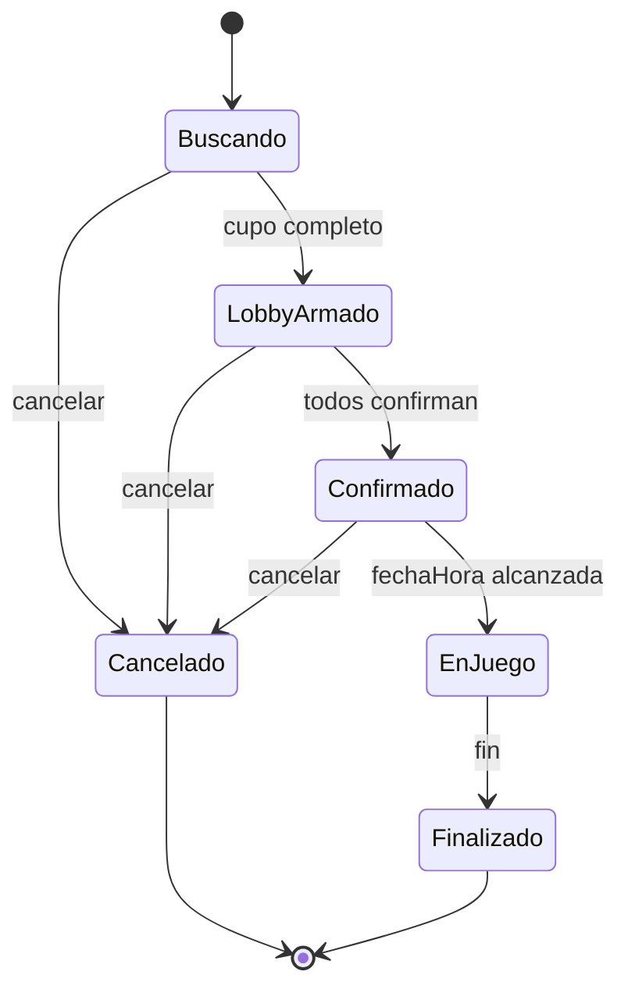

# Diagrama de estados

Texto extraído (versión legible):

- Buscando -> (cupo completo) -> LobbyArmado
- LobbyArmado -> (todos confirman) -> Confirmado
- Confirmado -> (fechaHora alcanzada) -> EnJuego
- EnJuego -> (fin) -> Finalizado
- Cualquier estado antes de EnJuego -> (cancelar) -> Cancelado

Mermaid diagram:

Notas:
- `LobbyArmado` es el estado en que el scrim tiene el cupo completo y espera confirmaciones.
- `Confirmado` debe transicionar a `EnJuego` automáticamente cuando la fecha/hora del scrim es alcanzada.
- `Cancelado` puede originarse desde cualquier estado anterior a `EnJuego`.
